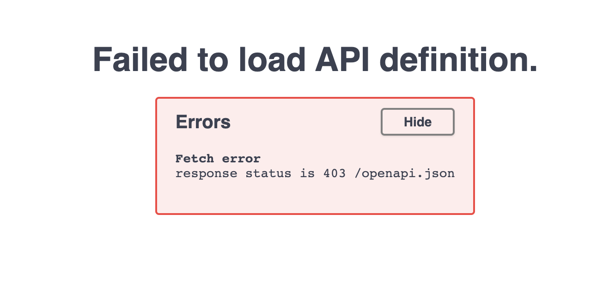
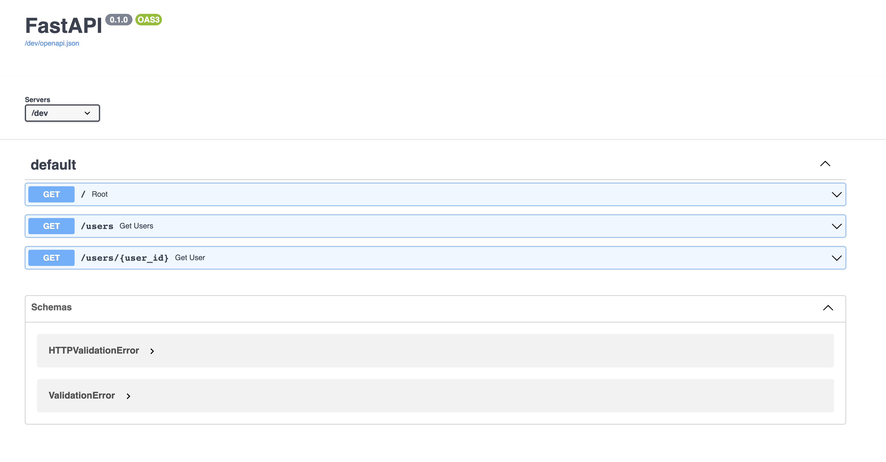

## Serverless demo with fast API

1. Setup Virtual Environment and [pip tools](https://github.com/jazzband/pip-tools)

   ```bash
   # Create virtual environment
   $ python -m venv venv

   # Activate virtual environment
   $ . venv/bin/activate

   # Install pip-tools for requirements management
   $ python -m pip install pip-tools

   # create requirements.in file in the root folder
   $ touch requirements.in
   ```

2. Install FAST API

   ```bash
   # Add dependencies
   $ echo "fastapi" >> requirements.in
   $ echo "uvicorn[standard]" >> requirements.in

   # Create requirements.txt from requirements.in
   $ pip-compile

   # install dependencies
   $ pip install -r requirements.txt
   ```

3. Write a Fast API

   ```bash
   # Create main.py file in the root folder
   $ touch main.py
   ```

   ```python
   # main.py
   from fastapi import FastAPI

   app = FastAPI()


   @app.get("/")
   def root():
   return {"message": "Hello World"}
   ```

   ```bash
   # run the server targeting app in main.py
   $ uvicorn main:app --reload

   $ INFO:     Will watch for changes in these directories: ['./fast-api-serverless']
   $ INFO:     Uvicorn running on http://127.0.0.1:8000 (Press CTRL+C to quit)
   $ INFO:     Started reloader process [60133] using watchgod

   # Test the server
   $ curl http://127.0.0.1:8000
   $ {"message":"Hello World"}

   # Docs should be visible here http://localhost:8000/docs or http://127.0.0.1:8000/redoc
   ```

   ```python
   # Add a new route to main.py
   @app.get("/users")
   def get_users():
       return {"message": "Get Users!"}
   ```

   ```bash
   # Test to see it working
   $  curl http://127.0.0.1:8000/users
   $ {"message":"Get Users!"}
   ```

   ```python
   # Add a new route to main.py
   @app.get("/users/{user_id}")
   def get_user(user_id: int):
       return {"user": user_id}
   ```

   ### Our folder structure looks something like this

   ```
   ├── venv
   ├── main.py
   ├── requirements.in
   ├── requirements.txt
   ```

4. Setup serverless for AWS deployment

   ```bash
   # Init NPM
   $ npm init
   # Install the serverless framework
   $ npm install serverless
   $ npm install serverless-python-requirements --dev
   ```

   Next we need to add an adaptor to the [ASGI](https://asgi.readthedocs.io/en/latest/) application to be deployed in an AWS Lambda function to handle API Gateway requests and responses we will use [Mangum](https://mangum.io/)

   ```bash
   $ echo "mangum" >> requirements.in

   # Update requirements.txt from requirements.in
   $ pip-compile

   # install dependencies
   $ pip install -r requirements.txt
   ```

   Now we need to modify main.py to use the adaptor

   ```python
   from fastapi import FastAPI
   from mangum import Mangum

   app = FastAPI()

   # routes...

   # Wrap the app with the Adaptor
   handler = Mangum(app)
   ```

   ```bash
   # Create serverless.yml file
   $ touch serverless.yml
   ```

   ```yaml
   service: fast-api-serverless-demo

   provider:
     name: aws
     runtime: python3.9
     region: af-south-1
     stage: ${opt:stage, "dev"}

   plugins:
     - serverless-python-requirements

   custom:
   pythonRequirements:
     dockerizePip: true
     layer:
     name: fast-api-serverless-demo-layer
     description: Requirements layer
     compatibleRuntimes:
       - python3.9

   package:
     individually: true
     include:
       - "main.py"
     exclude:
       - "__pycache__"
       - "requirements.txt"
       - "requirements.in"
       - "README.md"
       - "package.json"
       - "package-lock.json"
       - ".serverless/**"
       - "venv/**"
       - "node_modules/**"

   functions:
     app:
       # points to handler in main.py
       handler: main.handler
       environment:
       STAGE: ${self:provider.stage}
       layers:
         - { Ref: PythonRequirementsLambdaLayer }
       events:
         - http:
             method: get
             path: /
         - http:
             method: get
             path: /{proxy+}
   ```

5. Deployment

   ```bash
   $ AWS_PROFILE=<your profile> sls deploy -s dev

   Serverless: Running "serverless" installed locally (in service node_modules)
   .................................
   Serverless: Stack update finished...
   Service Information
   service: fast-api-serverless-demo
   stage: dev
   region: af-south-1
   stack: fast-api-serverless-demo-dev
   resources: 12
   api keys:
   None
   endpoints:
   GET - https://8z8kb7pc46.execute-api.af-south-1.amazonaws.com/dev/
   GET - https://8z8kb7pc46.execute-api.af-south-1.amazonaws.com/dev/{proxy+}
   functions:
   app: fast-api-serverless-demo-dev-app
   layers:
   pythonRequirements: arn:aws:lambda:af-south-1:569119040279:layer:fast-api-serverless-demo-layer
   ```

   Yay! We have deployed successfully! Lets test

   ```bash
   $ curl https://8z8kb7pc46.execute-api.af-south-1.amazonaws.com/dev/
   $ {"message":"Hello World"}

   $ curl https://8z8kb7pc46.execute-api.af-south-1.amazonaws.com/dev/users
   $ {"message":"Get Users!"}

   $ curl https://8z8kb7pc46.execute-api.af-south-1.amazonaws.com/dev/users/1
   $ {"user":1}
   ```

   API seems to work lets see if docs works..
   

   Oops is does not!
   We need to add the base path to our app config

   ```python
   # main.py
   import os
   from fastapi import FastAPI
   from mangum import Mangum

   # Get the stage from the environment variable
   stage = os.environ.get("STAGE", None)
   openapi_prefix = f"/{stage}" if stage else "/"

   app = FastAPI(openapi_prefix=openapi_prefix)
   ```

   Deploy again

   ```bash
   $ AWS_PROFILE=<your profile> sls deploy -s dev
   ```

   
